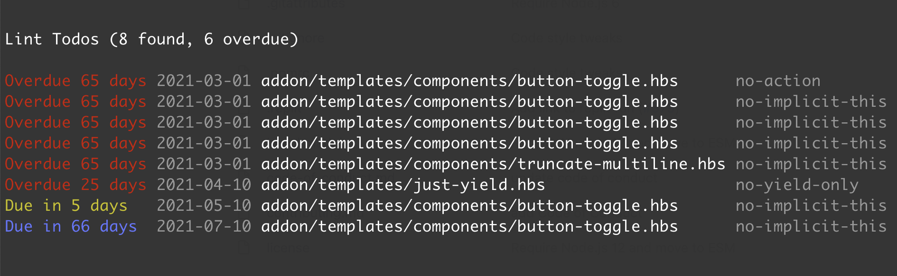

# @scalvert/ember-template-lint-formatter-todo

> A custom formatter for `ember-template-lint` that will display a table of todos for your project, sorted by due date.

## Install

```shell
npm i @scalvert/ember-template-lint-formatter-todo --save-dev

# or

yarn add @scalvert/ember-template-lint-formatter-todo --dev
```

## Usage

```shell
ember-template-lint . --format @scalvert/ember-template-lint-formatter-todo
```

Running with the formatter will output a table of todos, ordered by due dates sorted by when they're due.



If you'd like to restrict the output to a specific rule ID, just pass the `--rule` option to `ember-template-lint`.

```shell
ember-template-lint . --rule "no-implicit-this:error" --format @scalvert/ember-template-lint-formatter-todo
```
